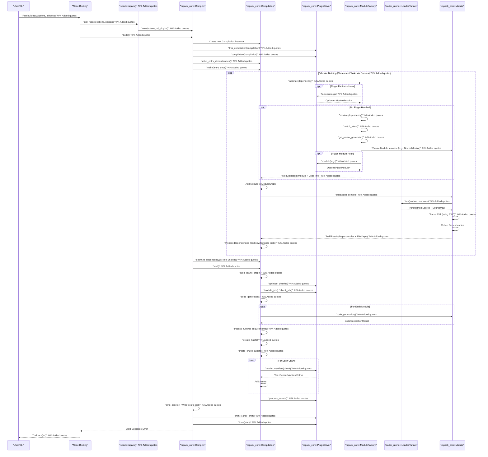

# Rspack 源码分析：最终架构与总结

本文档基于对 Rspack 核心 Crate 和关键流程的详细分析，提供了更精细的架构图和对 Rspack 实现思路、架构特点的总结。

## 1. 核心组件交互图 (Mermaid)

此图展示了 Rspack 核心组件之间的主要交互关系和数据流。

```mermaid
graph LR
    subgraph NodeJs_World [Node.js World]
        direction TB
        CLI["@rspack/cli"]
        DevServer["@rspack/dev-server"]
        UserConfig["rspack.config.js"]
        NodeBindingJS["binding.js"]
        JSPlugins["JS Plugins/Hooks"]
        JSLoaders["JS Loaders"]
    end

    subgraph Rust_World [Rust World]
        direction TB
        subgraph Binding_Layer [Binding Layer]
            NodeBindingRust[""crates/node_binding (NAPI)""] %% Added quotes
            OptionsBinding["rspack_binding_options"]
            JsHooksAdapter["JsHooksAdapter"]
            JsLoaderAdapter["JsLoaderAdapter"]
        end

        subgraph Facade_Layer [Facade Layer]
            RspackLib["crates/rspack"]
        end

        subgraph Core_Engine [Core Engine: crates/rspack_core]
            Compiler["Compiler"] -- Creates & Owns --> Compilation["Compilation"]
            Compiler -- Owns --> PluginDriver["PluginDriver"]
            Compiler -- Owns --> Cache["Cache"]

            Compilation -- Manages --> ModuleGraph["ModuleGraph"]
            Compilation -- Manages --> ChunkGraph["ChunkGraph"]
            Compilation -- Manages --> ChunkByUkey["Chunk Database"]
            Compilation -- Manages --> ChunkGroupByUkey["ChunkGroup Map"]
            Compilation -- Manages --> Assets["Assets Map"]
            Compilation -- Uses --> LoaderRunnerRunner["LoaderRunnerRunner"]
            Compilation -- Uses --> ResolverFactory["ResolverFactory"]
            Compilation -- Uses --> ParserGeneratorMap["Parser/Generator Map"]

            PluginDriver -- "Calls Hooks" --> RustPlugins["Rust Plugins"] %% Added quotes
            PluginDriver -- "Calls Hooks" --> JsHooksAdapter

            ModuleGraph -- Stores --> ModuleTrait["Module Trait Objects"]
            ChunkGraph -- Stores --> Chunk["Chunk"]
            ChunkGraph -- Stores --> ChunkGroup["ChunkGroup"]

            ModuleFactory["ModuleFactory Trait"] -- Creates --> ModuleTrait
            NormalModuleFactory["NormalModuleFactory"] -- Implements --> ModuleFactory
            ContextModuleFactory["ContextModuleFactory"] -- Implements --> ModuleFactory

            NormalModuleFactory -- Uses --> ResolverFactory
            NormalModuleFactory -- Uses --> PluginDriver
            NormalModuleFactory -- Uses --> Cache
            NormalModuleFactory -- Uses --> ParserGeneratorMap

            ContextModuleFactory -- Uses --> ResolverFactory
            ContextModuleFactory -- Uses --> Cache

            ModuleTrait -- "build() uses" --> LoaderRunnerRunner %% Added quotes
            ModuleTrait -- "build() uses" --> ParserGeneratorMap %% Added quotes
            ModuleTrait -- "code_generation()" --> Assets %% Added quotes
        end

        subgraph Tooling_Layer [Tooling & Utilities]
            LoaderRunnerCrate["crates/loader_runner"] -- Contains --> LoaderRunner["LoaderRunner"]
            LoaderRunnerCrate -- Contains --> LoaderTrait["Loader Trait"]
            ResolverCrate["nodejs-resolver"]
            SWCCrates["swc_core / swc_css"]
            ErrorUtil["rspack_error"]
            TracingUtil["rspack_tracing"]
            DatabaseUtil["rspack_database"]
            SourceUtil["rspack_sources"]
            OtherUtils["rspack_util, rspack_ids, ..."]
        end
    end

    %% Node.js to Rust Interactions
    UserConfig --> CLI
    UserConfig --> DevServer
    CLI --> NodeBindingJS
    DevServer --> NodeBindingJS
    JSPlugins --> NodeBindingJS
    JSLoaders --> NodeBindingJS
    NodeBindingJS --> NodeBindingRust

    %% Binding Layer Interactions
    NodeBindingRust -- Uses --> OptionsBinding
    NodeBindingRust -- Creates --> RspackLib
    NodeBindingRust -- Creates --> JsHooksAdapter
    NodeBindingRust -- Creates --> JsLoaderAdapter

    %% Facade Layer Interactions
    RspackLib -- Creates --> Compiler
    RspackLib -- "Provides Built-in" --> RustPlugins %% Added quotes

    %% Core Engine Interactions (Simplified)
    Compiler -- "Triggers Build" --> Compilation %% Added quotes
    Compilation -- "Factorize/Build" --> ModuleFactory %% Added quotes
    ModuleFactory -- Resolve --> ResolverFactory
    ResolverFactory -- Uses --> ResolverCrate
    ModuleFactory -- "Creates & Adds" --> ModuleTrait --> ModuleGraph %% Added quotes
    ModuleTrait -- "build() calls" --> LoaderRunnerRunner %% Added quotes
    LoaderRunnerRunner -- Uses --> LoaderRunnerCrate
    LoaderRunner -- Executes --> LoaderTrait
    LoaderTrait -- "Implemented by" --> JsLoaderAdapter %% Added quotes
    LoaderTrait -- "Implemented by" --> RustLoaders[""Rust Loaders (e.g., Sass)""] %% Added quotes
    ModuleTrait -- "build() uses" --> ParserGeneratorMap %% Added quotes
    ParserGeneratorMap -- Uses --> SWCCrates
    Compilation -- Seal --> ChunkGraph --> ChunkByUkey --> ChunkGroupByUkey
    Compilation -- Seal --> ModuleTrait -- "code_generation()" --> Assets %% Added quotes
    PluginDriver -- "Throughout Lifecycle" --> RustPlugins %% Added quotes
    PluginDriver -- "Throughout Lifecycle" --> JsHooksAdapter %% Added quotes

    %% Tooling Layer Usage
    LoaderRunnerCrate -- "Used by" --> Core_Engine %% Added quotes
    ResolverCrate -- "Used by" --> Core_Engine %% Added quotes
    SWCCrates -- "Used by" --> Core_Engine %% Added quotes
    ErrorUtil -- "Used Throughout" --> Rust_World %% Added quotes
    TracingUtil -- "Used Throughout" --> Rust_World %% Added quotes
    DatabaseUtil -- "Used by" --> Core_Engine %% Added quotes
    SourceUtil -- "Used by" --> Core_Engine %% Added quotes
    OtherUtils -- "Used by" --> Core_Engine %% Added quotes

    %% Style
    classDef node fill:#D0E0F0,stroke:#333,stroke-width:1px;
    classDef rust fill:#D0F0D0,stroke:#333,stroke-width:1px;
    classDef core fill:#FFDAB9,stroke:#333,stroke-width:2px;
    classDef facade fill:#F0E0D0,stroke:#333,stroke-width:1px;
    classDef binding fill:#E0D0F0,stroke:#333,stroke-width:1px;
    classDef tooling fill:#F0F0D0,stroke:#333,stroke-width:1px;
    classDef trait fill:#FFFACD,stroke:#888,stroke-width:1px,stroke-dasharray: 5 5;

    class NodeJs_World node;
    class Rust_World rust;
    class Core_Engine core;
    class Facade_Layer facade;
    class Binding_Layer binding;
    class Tooling_Layer tooling;
    class ModuleTrait,ModuleFactory,LoaderTrait trait;
```

## 2. 编译流程序列图 (高级别)

此图描绘了 Rspack 的主要编译流程。



## 3. Rspack 实现思路与架构总结

*   **Rust 核心:** Rspack 的核心逻辑完全使用 Rust 编写，旨在利用 Rust 的性能、内存安全和并发能力，以显著提升构建速度。
*   **Webpack 兼容性 (设计层面):** 整体架构、核心概念（Compiler, Compilation, Module, Chunk, ChunkGroup, Loader, Plugin）、生命周期钩子等在设计上很大程度借鉴了 Webpack，旨在降低 Webpack 用户的迁移成本，并复用 Webpack 成熟的生态设计。
*   **高性能:**
    *   **Rust 语言优势:** 避免了 Node.js 的 V8 开销和 GC 暂停。
    *   **多线程并发:** 大量使用 `rayon` 和 `tokio` 在 CPU 密集型任务（如 AST 解析、代码生成、压缩、资源写入）和 I/O 密集型任务（文件读取、解析）上进行并行处理。`Compilation::make` 阶段的并发任务队列是典型例子。
    *   **高效数据结构:** 使用 `rustc_hash` (FxHashMap/FxHashSet)、`dashmap` 等高性能哈希表。
    *   **缓存:** 内置了多层级的缓存机制（模块解析缓存、模块构建缓存、代码生成缓存）。
    *   **SWC:** 使用基于 Rust 的 SWC 进行 JavaScript/TypeScript/CSS 的 AST 解析和转换，相比基于 JS 的工具（如 Babel, Terser）有显著的速度优势。
*   **插件化架构:**
    *   核心编译流程 (`rspack_core`) 提供基础框架和钩子。
    *   大量核心功能（JS 处理、CSS 处理、资源处理、运行时生成、Devtool、优化等）通过内置插件 (`rspack_plugin_*`) 实现。
    *   通过 `Plugin` trait 和 `PluginDriver` 实现与 Webpack 类似的钩子系统，支持同步和异步钩子，以及 Bail Hook 行为。
*   **Loader 机制:**
    *   实现了独立的 `loader_runner` Crate，模拟 Webpack Loader 的反向执行链。
    *   支持 Rust Loader 和通过 `node_binding` 桥接的 JavaScript Loader。
*   **Node.js 绑定 (NAPI):**
    *   通过 `node_binding` Crate 使用 NAPI 将 Rust 核心封装为 Node.js Addon。
    *   实现了 JS 选项到 Rust 选项的转换 (`rspack_binding_options`)。
    *   通过适配器模式 (`JsHooksAdapter`, `JsLoaderAdapter`) 桥接了 JS 插件钩子和 Loader。
    *   使用 `unsafe` 和自定义的全局状态管理来处理 NAPI 环境下的编译器实例生命周期和线程安全问题。
*   **Tree Shaking:** 内置了基于 AST 分析的 Tree Shaking 功能，用于移除未使用的代码。
*   **模块化:** 项目结构清晰，按功能划分为不同的 Crate (`rspack_core`, `rspack_error`, `rspack_ids`, `rspack_plugin_*`, `loader_runner`, `node_binding` 等)。

## 4. 与 Webpack 的主要异同

*   **相同点:** 核心概念、插件和 Loader 接口设计、钩子系统、配置项（很多是兼容的）。
*   **不同点:**
    *   **语言:** Rspack (Rust) vs Webpack (JavaScript)。这是最根本的区别，带来了性能上的巨大差异。
    *   **性能:** Rspack 通常比 Webpack 快得多。
    *   **生态:** Webpack 拥有极其庞大和成熟的 Loader/Plugin 生态，Rspack 正在逐步兼容和建设自己的生态。Rspack 通过 NAPI 桥接可以使用部分 Webpack Loader，但并非所有 Loader 都能完美兼容。
    *   **内置功能:** Rspack 内置了更多开箱即用的功能（如 SWC 用于 JS/TS/CSS 处理、内置 Dev Server 基础），而 Webpack 更依赖社区插件。
    *   **配置细节:** 虽然很多配置项兼容，但仍存在一些差异和 Rspack 特有的配置。
    *   **内部实现:** 底层数据结构、并发模型、错误处理等实现细节完全不同。

## 5. 结论

Rspack 是一个雄心勃勃的项目，旨在利用 Rust 的强大能力重新实现 Webpack 的核心功能，以提供极致的构建性能。它在架构设计上很大程度地遵循了 Webpack 的模式，以便利用其成熟的设计思想和降低迁移成本，但在内部实现上则充分利用了 Rust 的并发、安全和性能优势。其插件化架构和对 JS Loader/Plugin 的桥接使其具备良好的可扩展性。对于追求极致构建速度的前端项目，Rspack 是一个非常有吸引力的选择。

**分析完成。**
